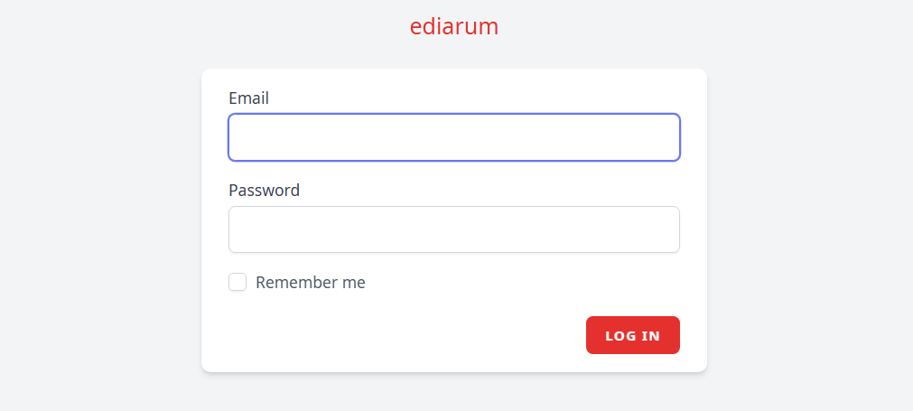
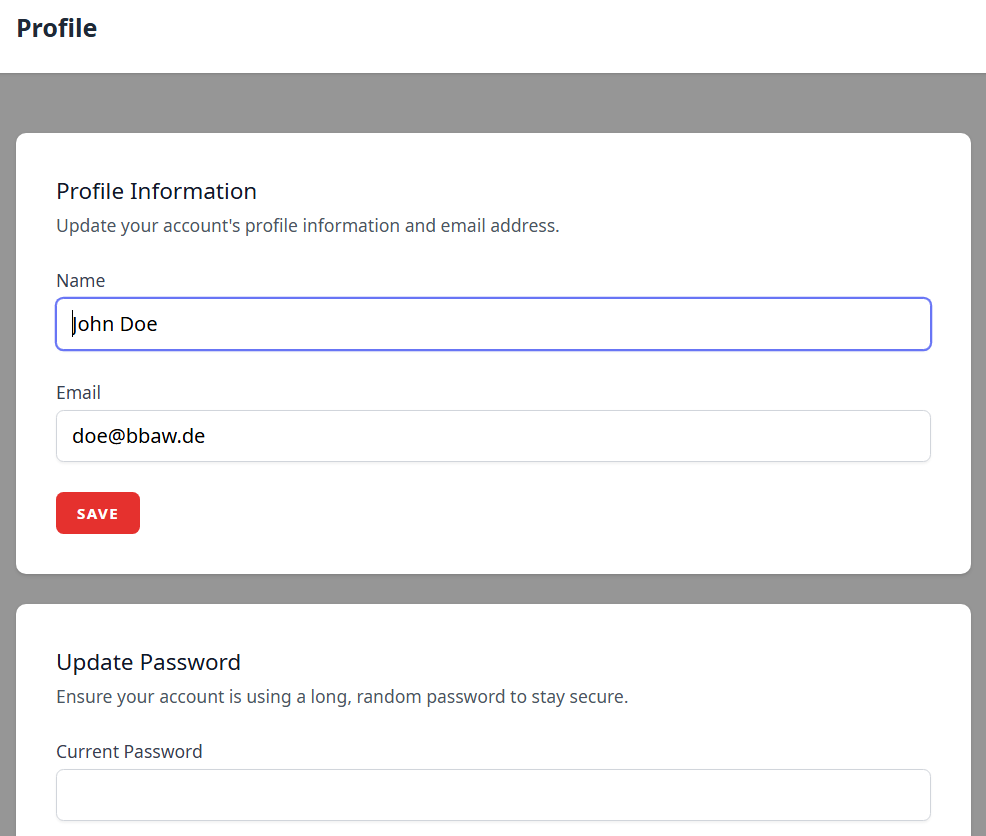
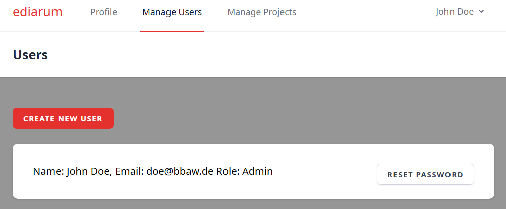
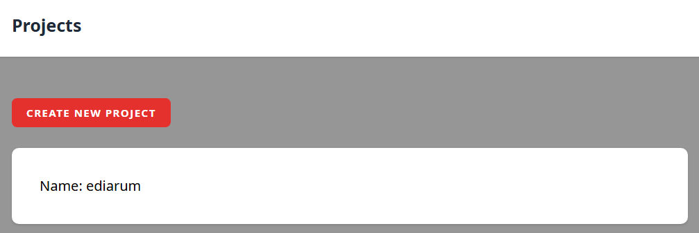
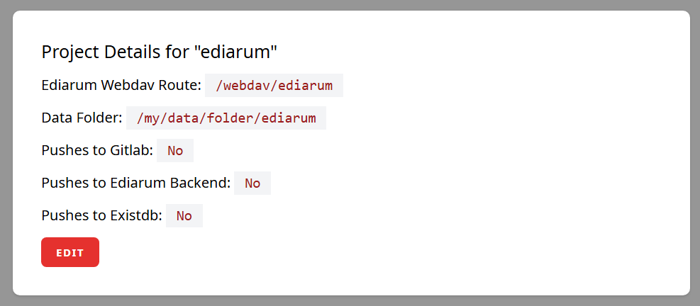
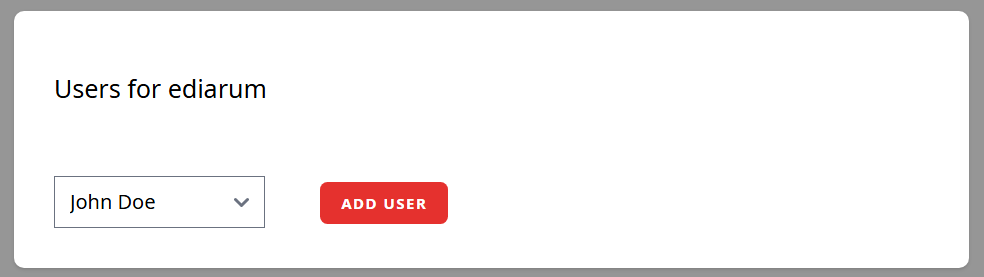
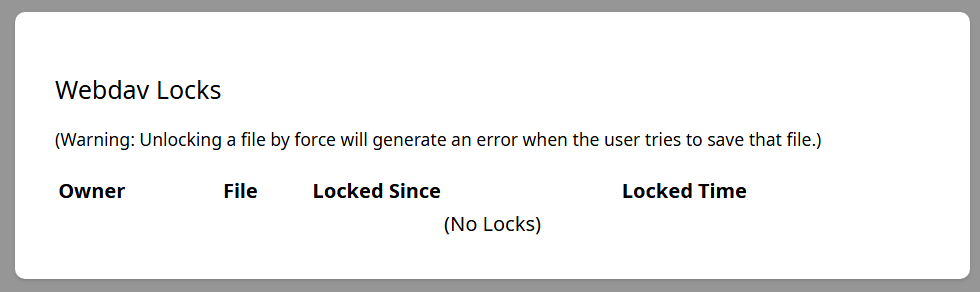

# Usage

## Login

* Go to `localhost:8000` or the service URL to log in to ediarum.WEBDAV.

For the first time using ediarum.WEBDAV use the user and password defined in the `.env` file.

After login there are different options:

* Update your profile
* Manage users (Admins only)
* Manage projects (Admins only)

## Profile

Here you can change your profile name, email, and password.

## Manage Users

Here an admin can add a new user or reset the password for an existing user.

### Add a new user

* Go to `Create new user` and fill in name, email, password.
* If the user should have admin rights (to manage users and projects) check the box "Make the user an Admin?"

*Attention:* Currently this setting can't be changed via the GUI after creating the user. To change this setting you must log in to MySQL and change in your database (e.g. `ediarum_webdav`) in the table `users` the field `is_admin` to `1`.

Once you an account is created, it can be used to login via webdav:

* Use the email and password to log in to the webdav, located at the `webdav` subroot, so for example: `localhost:8000/webdav`.

### Reset password for an existing user

* Go to `Reset password` to set a new automatic generated password for a user.

After logging in with the new password the user can change the password in his profile.

## Manage projects

Here an admin can add new projects or edit existing ones.

### Add a new project

With "Create new project" the following data can be added:

* **Project name:** for managing the projects
* **Slug:** Is used for the project webdav url, e.g. `localhost:8000/webdav/slug`.
* **Data Folder Location:** Add here the full path to the data folder (git repository folder) from root `/` of your machine.
* **Gitlab Url:** URL to the remote git repository.
* **Gitlab Username:** Used for authentification.
* **Gitlab PAT:** Project Access Token for the repository. At least must have read and write permissions to the repository.
* **Ediarum Backend Url:** Used for synchronisation with ediarum.BACKEND (in development).
* **Ediarum Backend Api Key:** Used for synchronisation with ediarum.BACKEND (in development).
* **eXist-db Base Url:** Used for synchronisation with eXist-db.
* **eXist-db Data Path:** The data path within the eXist-db, e.g. `/db/apps/my-project/data`
* **eXist-db Username:** User with write permissions to eXist-db.
* **eXist-db Password:** User password.

After creating a project an admin can see and edit the project details after going to the project.

#### Setting up a project with a git repository

In order to set up a project where all webdav changes are saved as git commits, it is necessary that the git repository of the project be saved on the server (`git clone https://my/git/repository.git`).

Then, in the settings to the project, the user must enter the absolute path to this repository (**Data Folder Location**).

If one sets up a project with **GitLab remote url**, **GitLab username**, and **Gitlab Personal Access Token** (PAT), then all new commits are automatically pushed to gitlab.

#### Setting up a synchronisation to eXist-db

If one sets up a project with **eXist-db Base URL**, **data path**, **username**, and **password** (PAT), then all new commits are automatically pushed to eXist-db.

### Add Users to a project

After creating a new project an admin can add and remove users in the project details page.

* For adding select a user and select "Add User".
* For removing select "Remove".

A user can be member of multiple projects. The user only has access to the data files within these projects (e.g. via `localhost:8000/webdav/project-1`).

### Manage WebDAV locks

In the project details page the current webdav locks are tracked.

